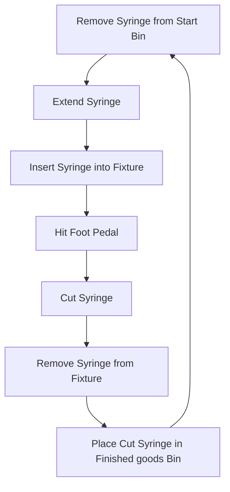

# Pad Printing automation and Syringe Die Cutting Automation

## Pad printing automation
Discussed with Joe Reisch
- Rate is 100 tubes printed per hour 
- Budget is to be determined
- Product Sample provided? (Check with manager)

## Syringe Die Cutting Automation

Current Flow

Don't use current fixtures as it is harder to adapt a manual process to automation rather then to start with one that is already taylor made for it.

Additional information provided by Sean on 12/29/2023
Syringe part number is 301029 bought in boxes of 850
Reference is 10 ML Non-Sterile BD Luer-Lok TIpped Syringe Only  
- Need CAD file of syringe
- Material is polypropylene
- Need blade to cut polypropylene
